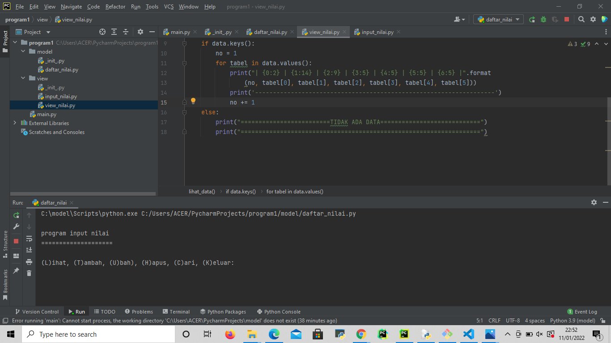

# uas

### profil
- _nama : Ade maulani bilgis_
- _Nim : 312110180_
- _kelas : 312110180_

**package dan modul**


**daftar nilai**
- tambah data
```py
def tambah_data():
    global data
    ulangi = 'y'
    while ulangi =='y':
        nama = input_nama()
        nim = input_nim()
        nilai_tugas = input_ntugas()
        nilai_uts = input_nuts()
        nilai_uas = input_nuas()
        nilai_akhir = nakhir()
        data[nama] = [nama, nim, nilai_tugas, nilai_uts, nilai_uas, nilai_akhir]
        ulangi = (input('tambah data?(y/t) : '))
        if ulangi == 't':
            print('\nData berhasil di tambah!')
            return data
```
   
